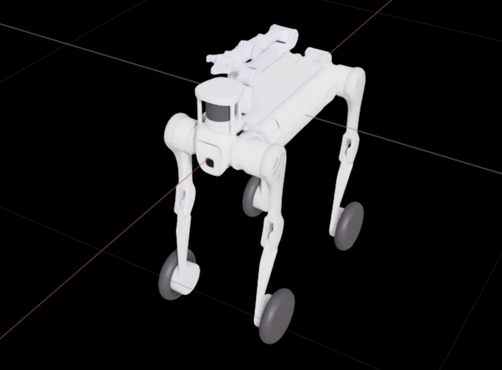
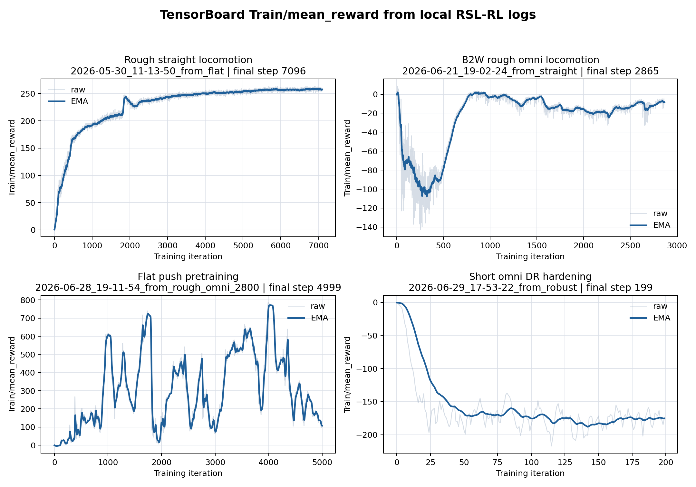

# 🤖 ATEC 2026 具身强化学习仿真挑战项目（线上赛）


> 本仓库用于展示 **ATEC 2026 具身智能仿真挑战赛** 项目的强化学习训练和仿真部署工程。  
> 项目面向 **Unitree B2W + AgileX Piper** 机器人，基于 **Isaac Lab v2.3.2 + RSL-RL PPO** 构建面向地面越野导航、推箱越障、平地行走预训练与提交部署的工程链路。

<p align="center">
  
  
  
</p>

---

## ✅ 项目亮点 / 可验证结果

- **完整具身 RL 工程链路**：完成 Isaac Lab 环境注册、RSL-RL PPO 训练、策略导出、地面越野导航 / 推箱越障本地播放、视频录制与官方提交接口适配。
- **多阶段课程学习**：构建 flat locomotion → rough straight walking → rough omni B2W policy → 推箱越障 fine-tuning 的递进式训练流程。
- **推箱越障专项设计**：围绕箱子接触、推箱、平台导航和终点通过设计任务观测、奖励与高层控制逻辑。
- **61D 观测 + 16D 动作接口**：推箱越障保持 61D policy observation 与 16D locomotion action，便于从平地行走预训练 checkpoint 迁移到官方推箱越障任务。
- **16D → 24D 官方动作适配**：将训练得到的 12 维腿部动作 + 4 维轮速动作扩展到官方 24D 动作接口，Piper 手臂 8 维动作固定 / 置零。
- **在线控制与鲁棒性逻辑**：`solution.py` 集成高层状态机、LiDAR / height-scan 修正、heading lock、speed correction、stuck recovery 与 score-aware phase switching。

---

## 🧩 技术挑战与解决方案

| 问题 | 解决方法 | 产生效果 |
|---|---|---|
| 地面越野导航需要机器人在粗糙地形和高度起伏上保持稳定移动，容易出现姿态扰动、轮腿打滑和速度衰减 | 采用 flat locomotion → rough straight walking → rough omni B2W policy 的课程训练流程，结合 rough terrain generator、terrain_levels curriculum、速度命令跟踪、root velocity / contact / action penalty 等配置 | 提升 B2W + Piper 在非平整地形上的通过性、姿态稳定性和速度保持能力，为后续推箱越障提供可靠底盘能力 |
| 推箱越障是长时序任务，从接近箱子、稳定接触、推箱到过坑 / 上平台和终点通过，任务链路长，直接强化学习训练难度高 | 将任务拆分为 flat pre-train → rough omni locomotion → 推箱越障 easy / medium / official fine-tuning 等阶段，采用课程学习逐步增加任务难度 | 降低从零训练复杂任务的难度，形成从基础运动到官方推箱越障任务的递进式训练流程 |
| 动作空间不一致：训练策略更适合输出紧凑的 16D locomotion action，但官方评测接口要求 24D action | 设计 deployment adapter，将 16D policy output 映射为 12D legs + 4D wheels，并将 8D Piper arm action 固定 / 置零 | 解决训练动作空间与官方提交动作空间不一致的问题，使策略可直接接入 `AlgSolution.predicts` |
| 推箱越障存在接触不稳定和地形障碍影响：推箱时容易顶偏、滑开或丢失箱子，坑、平台和高度变化又会导致速度衰减、偏航和卡死 | 在 `solution.py` 中加入高层状态机、heading lock、speed correction、LiDAR / height-scan 修正、stuck recovery 和 score-aware phase switching | 提升策略在官方评测接口下的鲁棒性，减少卡死、接触丢失和错误阶段切换 |
| Isaac Lab / Isaac Sim 训练、播放、录像和 GUI 依赖复杂，复现实验成本高 | 封装 `scripts/env`、`scripts/train`、`scripts/evaluate`、`scripts/export` 和通用 `train-env.sh` / `play-env.sh` / `view-env.sh` | 降低复现实验门槛，支持 smoke test、视频验证和提交前本地检查 |

---

## 📊 项目结果

| 指标 | 结果 |
|---|---|
| 任务方向 | 地面越野导航；推箱越障；平地行走预训练 |
| 仿真平台 | Isaac Sim + Isaac Lab v2.3.2 |
| 强化学习算法 | RSL-RL PPO |
| 机器人平台 | Unitree B2W + AgileX Piper |
| 动作适配方式 | 16D policy output → 12D legs + 4D wheels + 8D fixed arm |
| 训练流程 | flat locomotion → rough straight → rough omni → 推箱越障 fine-tuning |
| 得分排名 | 32/100 |

训练曲线来自本地 RSL-RL TensorBoard 日志的 `Train/mean_reward`，用于展示训练过程趋势，不等同于官方评测得分。



---

## 🎯 任务说明与技术难点

### 地面越野导航

地面越野导航关注 B2W + Piper 机器人在复杂地形中的运动能力，重点验证策略在非平整地形上的稳定移动、姿态保持和导航能力。

### 推箱越障

推箱越障要求机器人完成推箱、越障、平台导航和终点通过等组合行为。该任务不是单纯 locomotion，而是具有明显阶段结构的 loco-manipulation 任务。

上述挑战与对应方案已汇总在“技术挑战与解决方案”表格中；最终部署必须通过 `AlgSolution.predicts(obs, current_score)` 返回官方动作格式。

---

## 🧠 核心方案

### 1. 多阶段课程学习

训练流程按任务难度逐步递进：

```text
flat locomotion
  -> rough straight walking
  -> rough omni B2W policy
  -> 平地行走预训练
  -> 推箱越障 easy / medium / official fine-tuning
  -> policy export
  -> official submission adapter
```

对应脚本：

```bash
# Rough straight walking from a flat checkpoint
./scripts/train/train-b2-rough-straight-from-flat.sh

# B2W + Piper rough omni policy
./scripts/train/train-b2w-rough-omni-from-straight.sh

# 推箱越障 official fine-tuning
./scripts/train/train-taskd-finetune.sh official

# 平地行走预训练 -> 官方推箱越障迁移
ATEC_TASKD_ITERS=7000 ATEC_TRAIN_NUM_ENVS=1024 \
  ./scripts/train/train-taskd-from-flat-pretrain.sh
```

### 2. 推箱越障观测与动作设计

推箱越障采用紧凑的 locomotion policy 形式：

| 模块 | 维度 | 说明 |
|---|---:|---|
| Policy observation | 61D | 包含机器人状态、命令、关节状态、历史动作和任务相关信息 |
| Locomotion action | 16D | 12 维腿部动作 + 4 维轮速动作 |
| Official action | 24D | 12 维腿部动作 + 4 维轮速动作 + 8 维 Piper 手臂动作 |

这样做的目的：

- policy 只学习和移动 / 推箱直接相关的 leg + wheel 控制；
- Piper arm 在该任务中固定，减少不必要的动作维度；
- 训练策略与官方评测接口通过 adapter 解耦。

### 3. 官方提交接口适配

官方评测调用：

```python
class AlgSolution:
    def predicts(self, obs, current_score):
        return {"action": action, "giveup": False}
```

本项目将训练策略输出映射到官方动作空间：

| Slice | 含义 | 部署行为 |
|---|---|---|
| `0:12` | Leg joint position commands | 来自 locomotion policy |
| `12:16` | Wheel velocity commands | 来自 locomotion policy |
| `16:24` | Piper arm position commands | 固定 / 置零 |

### 4. `solution.py` 在线控制逻辑

`submission/solution.py` 是官方提交入口，集成：

- policy loading / inference；
- 推箱越障 high-level state machine；
- approach box / push box / nav platform / climb finish 阶段切换；
- scripted path / side push / pit push / teleop / waypoint route 多种调试模式；
- heading lock；
- speed correction；
- LiDAR / height-scan correction；
- stuck recovery；
- score-aware phase switching；
- 16D policy action 到 24D official action 的映射。

---

## 📁 系统结构

```text
src/atec_rl_lab/
  train/locomotion/velocity/
    config/quadruped/unitree_b2/      custom training envs and PPO configs
    mdp/                              rewards, commands, observations, events

tools/atec/
  list_envs.py                        environment listing
  play_task.py                        evaluation runner
  rsl_rl/
    train.py                          RSL-RL training entry point
    play.py                           training policy playback + export

scripts/
  env/                                conda + Isaac Lab workspace activation
  train/                              curriculum training scripts
  evaluate/                           playback and video recording
  export/                             policy export scripts

submission/
  solution.py                         official submission entrypoint
  policy*.pt                          local policy artifacts

outputs/rsl_rl/                       training checkpoints
```

训练环境注册入口：

```text
src/atec_rl_lab/train/locomotion/velocity/config/quadruped/unitree_b2/__init__.py
```

官方提交部署入口：

```text
submission/solution.py
```

---

## 🚀 核心运行流程

### 1. 环境检查

```bash
source scripts/env/activate-atec2026-sim.sh
python tools/atec/list_envs.py
```

### 2. 地面越野导航回放

```bash
python tools/atec/play_task.py \
  --task ATEC-TaskA-B2wPiper \
  --headless --enable_cameras --disable_fabric \
  --num_envs 1 --debug
```

录像：

```bash
./scripts/evaluate/record-task-a-video.sh
```

### 3. 推箱越障训练

```bash
# Smoke test
ATEC_TASKD_ITERS=10 ATEC_TRAIN_NUM_ENVS=64 \
  ./scripts/train/train-taskd-finetune.sh official

# Full fine-tuning
./scripts/train/train-taskd-finetune.sh official

# Export policy
./scripts/export/export-taskd-finetune-policy.sh official
```

### 4. 平地行走预训练 → 推箱越障迁移

平地行走被用作推箱越障的平地预训练阶段。它与官方推箱越障任务保持 **61D observation + 16D action**，因此 actor checkpoint 可以 exact match 加载。

```bash
ATEC_TASKD_ITERS=7000 ATEC_TRAIN_NUM_ENVS=1024 \
  ./scripts/train/train-taskd-from-flat-pretrain.sh
```

---

## 🧪 Key Environment IDs

| Environment | Purpose |
|---|---|
| `ATEC-Isaac-Velocity-Rough-Straight-Unitree-B2-v0` | B2 rough straight curriculum |
| `ATEC-Isaac-Velocity-Rough-Omni-B2W-Piper-v0` | B2W + Piper rough omni locomotion |
| `ATEC-Isaac-Velocity-Flat-TaskF-Unitree-B2W-Piper-v0` | 平地行走到推箱越障的预训练 |
| `ATEC-Isaac-Velocity-ShortOmniDR-TaskF-Unitree-B2W-Piper-v0` | 平地行走 domain-randomized hardening |

---

## Repository Notes

- `docs/upstream/` contains original challenge documentation kept as upstream-facing reference.
- `AGENTS.md` and `CLAUDE.md` provide command references for training, playback, and environment viewing.
- Default Docker submissions require `submission/policy.pt`; optional extra models live in `submission/models/` and can be selected with `ATEC_POLICY_PATH=solution/models/<file>.pt`.
- Large assets are intentionally excluded from GitHub: `IsaacLab/`, `outputs/`, `artifacts/`, robot model downloads, submission zips, and local checkpoints.

---

## License

The project source code is available under the MIT license. Third-party components such as Isaac Lab and robot assets follow their respective upstream licenses.
