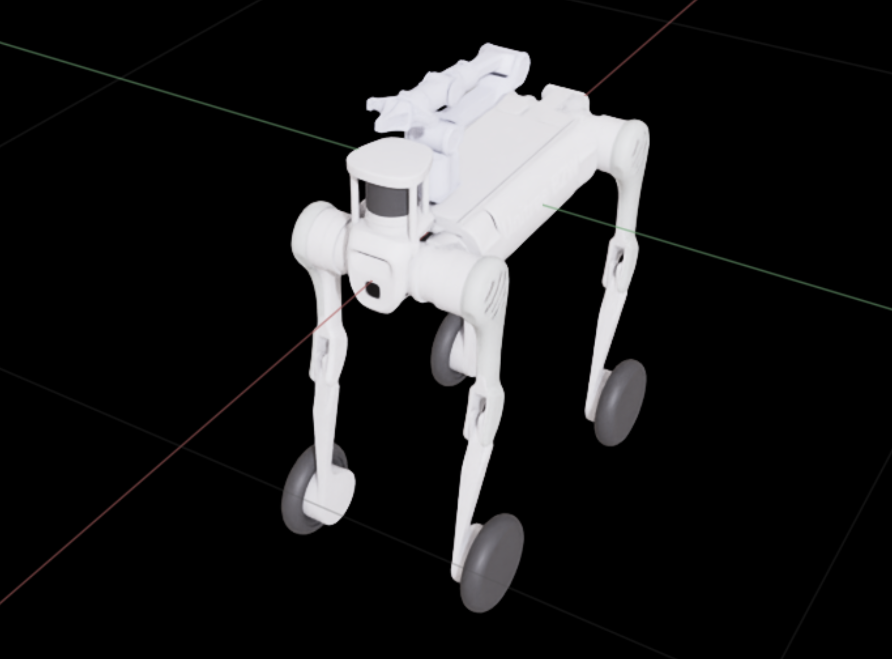
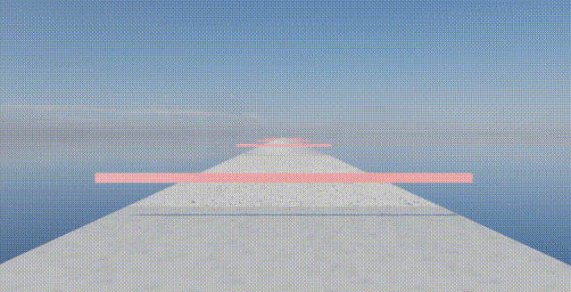
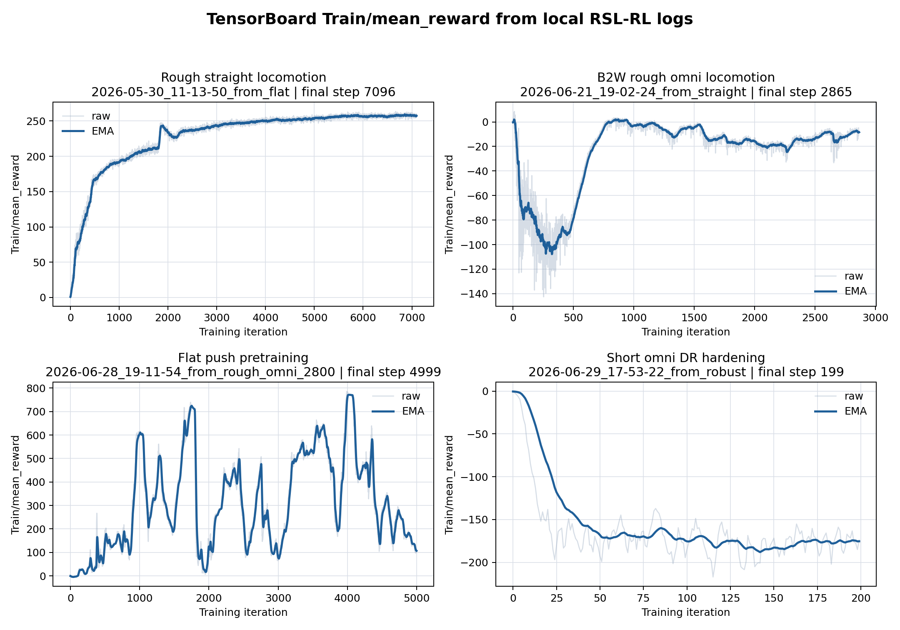

# 🤖 ATEC 2026 Embodied RL Simulation Challenge Project (Online)


> This repository showcases the reinforcement-learning training and simulation deployment engineering for the **ATEC 2026 Embodied Intelligence Simulation Challenge**.
> The project targets the **Unitree B2W + AgileX Piper** robot and uses **Isaac Lab v2.3.2 + RSL-RL PPO** to build an engineering pipeline for off-road navigation, box-pushing obstacle traversal, flat-walking pre-training, and official submission deployment.

[中文](README.zh-CN.md)

<p align="center">
  
  
  
</p>

---

## ✅ Highlights / Verifiable Results

- **Complete embodied-RL engineering pipeline**: Isaac Lab environment registration, RSL-RL PPO training, policy export, local playback for off-road navigation / box-pushing obstacle traversal, video recording, and official submission interface adaptation.
- **Multi-stage curriculum learning**: flat locomotion -> rough straight walking -> rough omni B2W policy -> box-pushing obstacle traversal fine-tuning.
- **Task-D-specific loco-manipulation design**: task observations, rewards, and high-level control logic designed around box contact, box pushing, platform navigation, and final-goal traversal.
- **61D observation + 16D action interface**: Task D keeps a 61D policy observation and 16D locomotion action so flat-walking pre-training checkpoints can transfer to the official box-pushing task.
- **16D -> 24D official action adapter**: expands the trained 12D leg actions + 4D wheel actions to the official 24D action interface, with the 8D Piper arm action fixed / zeroed.
- **Online control and robustness logic**: `solution.py` integrates a high-level state machine, LiDAR / height-scan correction, heading lock, speed correction, stuck recovery, and score-aware phase switching.

---

## 🧩 Technical Challenges and Solutions

| Problem | Solution | Effect |
|---|---|---|
| Off-road navigation requires stable movement over rough terrain and height variation, where posture disturbance, wheel-leg slip, and speed decay are common | Use a flat locomotion -> rough straight walking -> rough omni B2W policy curriculum with a rough terrain generator, terrain-level curriculum, velocity-command tracking, root velocity / contact / action penalties, and related configs | Improves traversability, posture stability, and speed retention for B2W + Piper on uneven terrain, providing a reliable base for later box-pushing tasks |
| Box-pushing obstacle traversal is a long-horizon task covering box approach, stable contact, pushing, pit / platform traversal, and final-goal passage; direct RL training is difficult | Split the task into flat pre-train -> rough omni locomotion -> box-pushing easy / medium / official fine-tuning stages, increasing difficulty through curriculum learning | Reduces the difficulty of training a complex task from scratch and forms a staged path from basic movement to the official obstacle traversal task |
| Action spaces differ: the training policy is better suited to a compact 16D locomotion action, while the official evaluator requires a 24D action | Add a deployment adapter that maps 16D policy output to 12D legs + 4D wheels and fixes / zeroes the 8D Piper arm action | Resolves the mismatch between the training action space and official submission action space, allowing direct integration with `AlgSolution.predicts` |
| Box pushing is sensitive to unstable contact and terrain obstacles: the robot may push off-angle, slip away, lose the box, slow down, yaw, or get stuck around pits and platforms | Add a high-level state machine, heading lock, speed correction, LiDAR / height-scan correction, stuck recovery, and score-aware phase switching in `solution.py` | Improves robustness under the official evaluator by reducing stuck states, contact loss, and incorrect phase transitions |
| Isaac Lab / Isaac Sim training, playback, recording, and GUI dependencies are complex, making reproduction costly | Wrap environment activation, training, evaluation, export, and generic `train-env.sh` / `play-env.sh` / `view-env.sh` flows under scripts | Lowers reproduction cost and supports smoke tests, video validation, and local checks before submission |

---

## 📊 Project Results

| Metric | Result |
|---|---|
| Task direction | Off-road navigation; box-pushing obstacle traversal; flat-walking pre-training |
| Simulation platform | Isaac Sim + Isaac Lab v2.3.2 |
| RL algorithm | RSL-RL PPO |
| Robot platform | Unitree B2W + AgileX Piper |
| Action adapter | 16D policy output -> 12D legs + 4D wheels + 8D fixed arm |
| Training flow | flat locomotion -> rough straight -> rough omni -> box-pushing fine-tuning |
| Score ranking | 32/100 |

The training curve comes from the local RSL-RL TensorBoard `Train/mean_reward` logs and shows the training trend. It is not the official evaluation score.



---

## 🎯 Task Description and Technical Difficulty

### Off-Road Navigation

Off-road navigation focuses on B2W + Piper locomotion over complex terrain, validating stable movement, posture retention, and navigation ability on uneven ground.

### Box-Pushing Obstacle Traversal

Box-pushing obstacle traversal requires the robot to complete box pushing, obstacle traversal, platform navigation, and final-goal passage. It is not pure locomotion; it is a staged loco-manipulation task.

The challenges and corresponding solutions are summarized in the "Technical Challenges and Solutions" table. Final deployment must return the official action format through `AlgSolution.predicts(obs, current_score)`.

---

## 🧠 Core Approach

### 1. Multi-Stage Curriculum Learning

The training flow increases task difficulty step by step:

```text
flat locomotion
  -> rough straight walking
  -> rough omni B2W policy
  -> flat-walking pre-training
  -> box-pushing easy / medium / official fine-tuning
  -> policy export
  -> official submission adapter
```

Related scripts:

```bash
# Rough straight walking from a flat checkpoint
./scripts/train/train-b2-rough-straight-from-flat.sh

# B2W + Piper rough omni policy
./scripts/train/train-b2w-rough-omni-from-straight.sh

# Box-pushing official fine-tuning
./scripts/train/train-taskd-finetune.sh official

# Flat-walking pre-training -> official box-pushing transfer
ATEC_TASKD_ITERS=7000 ATEC_TRAIN_NUM_ENVS=1024 \
  ./scripts/train/train-taskd-from-flat-pretrain.sh
```

### 2. Box-Pushing Observation and Action Design

Task D uses a compact locomotion-policy form:

| Module | Dimension | Description |
|---|---:|---|
| Policy observation | 61D | Robot state, command, joint state, previous action, and task-related information |
| Locomotion action | 16D | 12D leg action + 4D wheel velocity action |
| Official action | 24D | 12D leg action + 4D wheel velocity action + 8D Piper arm action |

This design keeps:

- the policy focused on leg + wheel control directly related to movement and box pushing;
- the Piper arm fixed in this task to avoid unnecessary action dimensions;
- the training policy decoupled from the official evaluator through an adapter.

### 3. Official Submission Interface Adapter

The official evaluator calls:

```python
class AlgSolution:
    def predicts(self, obs, current_score):
        return {"action": action, "giveup": False}
```

This project maps the trained policy output to the official action space:

| Slice | Meaning | Deployment behavior |
|---|---|---|
| `0:12` | Leg joint position commands | From locomotion policy |
| `12:16` | Wheel velocity commands | From locomotion policy |
| `16:24` | Piper arm position commands | Fixed / zeroed |

### 4. Online Control Logic in `solution.py`

`submission/solution.py` is the official submission entrypoint and integrates:

- policy loading / inference;
- box-pushing high-level state machine;
- approach box / push box / nav platform / climb finish phase switching;
- scripted path / side push / pit push / teleop / waypoint route debug modes;
- heading lock;
- speed correction;
- LiDAR / height-scan correction;
- stuck recovery;
- score-aware phase switching;
- mapping from 16D policy action to 24D official action.

---

## 📁 System Structure

```text
src/atec_rl_lab/
  train/locomotion/velocity/
    config/quadruped/unitree_b2/      custom training envs and PPO configs
    mdp/                              rewards, commands, observations, events

tools/atec/
  list_envs.py                        environment listing
  play_task.py                        evaluation runner
  rsl_rl/
    train.py                          RSL-RL training entry point
    play.py                           training policy playback + export

scripts/
  env/                                conda + Isaac Lab workspace activation
  train/                              curriculum training scripts
  evaluate/                           playback and video recording
  export/                             policy export scripts

submission/
  solution.py                         official submission entrypoint
  policy*.pt                          local policy artifacts

outputs/rsl_rl/                       training checkpoints
```

Training environment registration entry:

```text
src/atec_rl_lab/train/locomotion/velocity/config/quadruped/unitree_b2/__init__.py
```

Official submission deployment entry:

```text
submission/solution.py
```

---

## 🚀 Core Workflows

### 1. Environment Check

```bash
source scripts/env/activate-atec2026-sim.sh
python tools/atec/list_envs.py
```

### 2. Off-Road Navigation Playback

```bash
python tools/atec/play_task.py \
  --task ATEC-TaskA-B2wPiper \
  --headless --enable_cameras --disable_fabric \
  --num_envs 1 --debug
```

Record video:

```bash
./scripts/evaluate/record-task-a-video.sh
```

### 3. Box-Pushing Training

```bash
# Smoke test
ATEC_TASKD_ITERS=10 ATEC_TRAIN_NUM_ENVS=64 \
  ./scripts/train/train-taskd-finetune.sh official

# Full fine-tuning
./scripts/train/train-taskd-finetune.sh official

# Export policy
./scripts/export/export-taskd-finetune-policy.sh official
```

### 4. Flat-Walking Pre-Training -> Box-Pushing Transfer

Flat walking is used as a flat-terrain pre-training stage for box-pushing obstacle traversal. It keeps the same **61D observation + 16D action** as the official task, so actor checkpoints can be loaded as exact matches.

```bash
ATEC_TASKD_ITERS=7000 ATEC_TRAIN_NUM_ENVS=1024 \
  ./scripts/train/train-taskd-from-flat-pretrain.sh
```

---

## 🧪 Key Environment IDs

| Environment | Purpose |
|---|---|
| `ATEC-Isaac-Velocity-Rough-Straight-Unitree-B2-v0` | B2 rough straight curriculum |
| `ATEC-Isaac-Velocity-Rough-Omni-B2W-Piper-v0` | B2W + Piper rough omni locomotion |
| `ATEC-Isaac-Velocity-Flat-TaskF-Unitree-B2W-Piper-v0` | Flat-walking pre-training for box-pushing transfer |
| `ATEC-Isaac-Velocity-ShortOmniDR-TaskF-Unitree-B2W-Piper-v0` | Flat-walking domain-randomized hardening |

---

## Repository Notes

- `docs/upstream/` contains original challenge documentation kept as upstream-facing reference.
- `AGENTS.md` and `CLAUDE.md` provide command references for training, playback, and environment viewing.
- Default Docker submissions require `submission/policy.pt`; optional extra models live in `submission/models/` and can be selected with `ATEC_POLICY_PATH=solution/models/<file>.pt`.
- Large assets are intentionally excluded from GitHub: `IsaacLab/`, `outputs/`, `artifacts/`, robot model downloads, submission zips, and local checkpoints.

---

## License

The project source code is available under the MIT license. Third-party components such as Isaac Lab and robot assets follow their respective upstream licenses.
